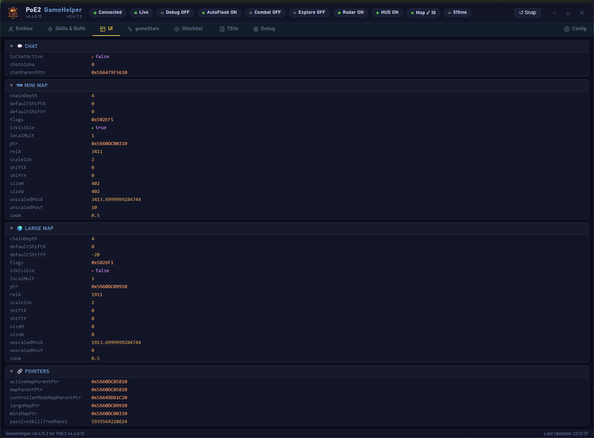
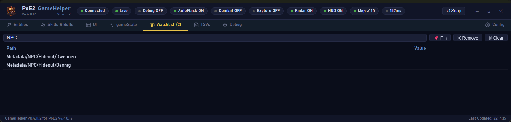
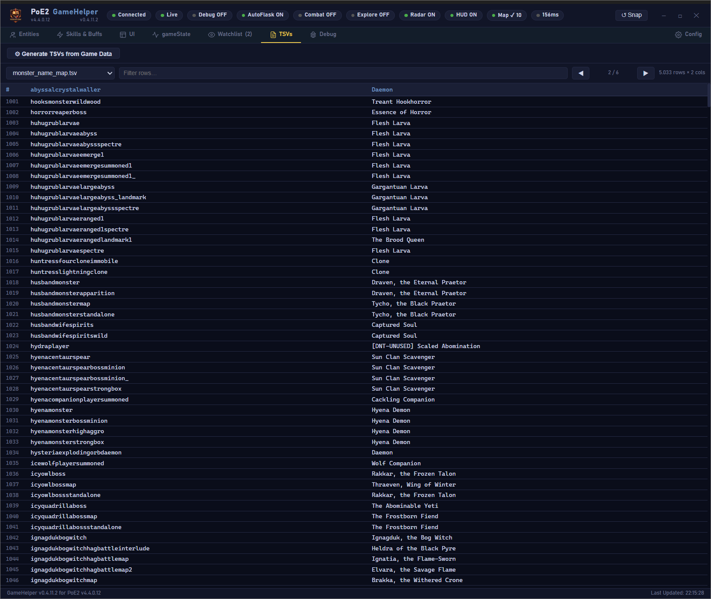

# PoE2 GameHelper — Developer Documentation

## Architecture Overview
### Core Systems
- MemoryReader — pattern scanning, pointer resolution, memory access
- Entity System — decoding entities, components, stats, metadata
- Overlay Engine — GDI renderer with isometric projection
- Navigation Engine — A* pathfinding with dynamic step resolution
- WebView Bridge — JS ↔ AHK communication layer

---

## Memory Layout

### Key Pointers
| Component      | Example Address     | Description                     |
|----------------|---------------------|---------------------------------|
| PlayerStruct   | 0x55D5BAF90200      | Local player pointer            |
| LifeComponent  | 0x55D5B830420       | Player vitals                   |
| ServerData     | 0x55D5BAF92800      | Flask inventory, player data    |
| StatesPtr      | 0x55D5D087010       | Game state summary              |
| MiniMapPtr     | 0x5660BC00310       | Minimap UI element              |
| LargeMapPtr    | 0x5660BC09910       | Large map UI element            |

---

## Pattern Scanning

### Pattern Example
```ahk
; Example: scan for a signature, then resolve RIP-relative addressing
pattern := "48 8B ?? ?? ?? ?? ?? 48 8B ?? ?? ?? ?? ?? 48 8B"
address := Memory.ScanPattern(pattern)
resolved := Memory.ResolveRIP(address)
; 'address' is the raw match; 'resolved' is the final absolute pointer after RIP resolution
```

### Features
- RIP‑relative resolution for position‑independent code
- Signatures stored in StaticOffsetsPatterns.ahk
- Hot‑reload support for rapid iteration
- Automatic pointer chain resolution (multi‑level dereference)

---

## Component Decoders

| Decoder            | Purpose                                 |
|--------------------|-----------------------------------------|
| LifeComponent      | HP, Mana, Energy Shield                 |
| RenderComponent    | Position, orientation, visibility       |
| StatsComponent     | Buffs, charges, attributes              |
| InventoryComponent | Item slots, metadata, socket info       |
| Transitionable     | Area transitions, portal/door handling  |

### Decoder Notes
- Decoders should be idempotent and fast.
- Keep decoding logic separate from rendering/UI code.
- Register new decoders centrally in PoE2EntityReader.ahk.
- Add unit tests or debug views for complex decoders.

---

## Navigation Engine
- A* algorithm with 3‑tier step resolution (2 / 4 / 8)
- Zone scanning via TgtTilesLocations
- Path smoothing and collision avoidance
- Real‑time path updates and re‑routing
- Integration with overlay renderer for visual debugging

---

## Overlay Engine
- GDI+ based renderer optimized for low CPU overhead
- Isometric projection helpers for world→screen conversion
- Layered drawing (map, entities, paths, UI overlays)
- Configurable scaling and W2S (world‑to‑screen) parameters
- Draw routines must respect clipping and performance budgets

---

## Tabs
- Entities Tab — lists NPCs, monsters, distances, and states


- Skills & Buffs Tab — cooldowns, timers, charges, buff sources


- UI Tab — pointer tracking, UI element states, visibility


- GameState Tab — InGame, Loading, Menu states, player vitals


- WatchList Tab — persistent tracking of specific NPCs/monsters


- TSV Tab — monster_name_map.tsv


---

## Configuration & Automation
- AutoFlask: thresholds, cooldown awareness, performance modes
- Combat Automation: engage/disengage distances, GCD handling
- Exploration: auto‑explore heuristics and A* integration
- Skill mapping: slot configuration, hotkey bindings, priority rules
- Persistent config stored in INI/JSON (config manager abstraction)

---

## Extending the Project

### Add a new component decoder
1. Create a new file in PoE2ComponentDecoders/ (e.g., MyDecoder.ahk).
2. Implement a Decode<ComponentName>(ptr) function that returns a lightweight object.
3. Register the decoder in PoE2EntityReader.ahk so it runs during entity processing.
4. Add unit tests or a debug view entry if the decoder affects gameplay logic.

### Add a new overlay element
1. Add draw routine to RadarOverlay.ahk (follow existing layering conventions).
2. Expose a config toggle in the WebView bridge (UIHelpers).
3. Ensure the draw routine respects scaling, clipping, and performance budgets.
4. Add a debug toggle and optional logging for development.

---

## Memory Access Patterns & Safety
- Always validate pointers before dereferencing.
- Use read buffers and batch reads where possible to reduce syscall overhead.
- Gracefully handle access violations and process restarts.
- Keep admin privilege checks centralized.
- Log pointer resolutions and pattern matches for debugging.

---

## Versioning

| Module        | Version    | PoE2 Compatibility |
|---------------|------------|--------------------|
| GameHelper    | v0.4.21.7  | PoE2 v4.2.0.12     |
| AutoFlask     | v0.4.11.2  | PoE2 v4.4.0.12     |
| RadarOverlay  | v0.4.12f   | PoE2 v4.0.12f      |

---

## Future Development
- Dynamic offset discovery and signature generation tooling
- Flask AI optimization (contextual usage)
- Improved zone auto‑exploration heuristics
- WebView performance tuning and virtualization
- Advanced entity filtering, tagging, and watchlist automation

---

## Testing & Debugging
- Use the debug panel to validate decoders and offsets.
- Maintain a small suite of smoke tests for core readers.
- Provide a "safe mode" that disables automation features for testing.
- Capture and rotate logs for long‑running sessions.

---

## Contributing
- Follow repository coding conventions (AHK v2 style).
- Open PRs against develop with clear descriptions and tests.
- Keep changes modular and document new offsets/patterns.
- Include changelog entries for offset/signature updates.

---

## License
MIT License — free for modification and redistribution.