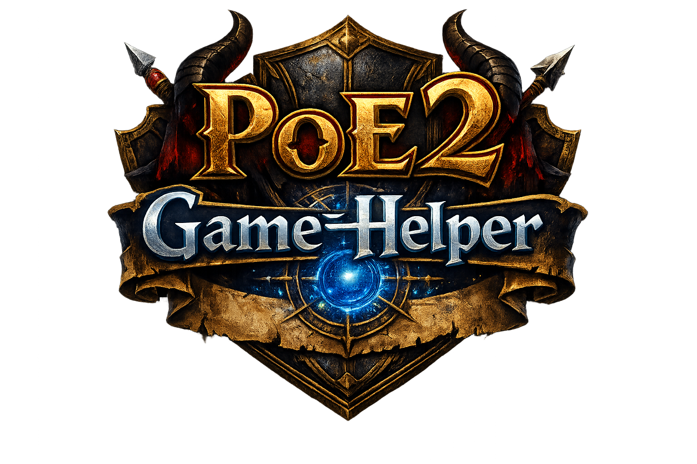
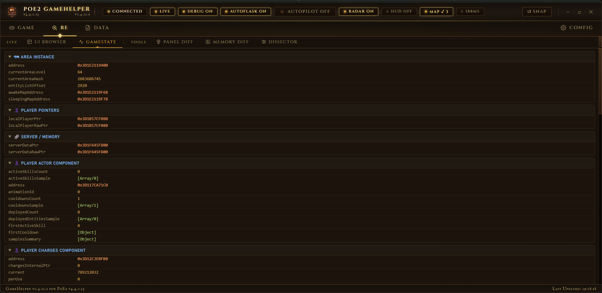
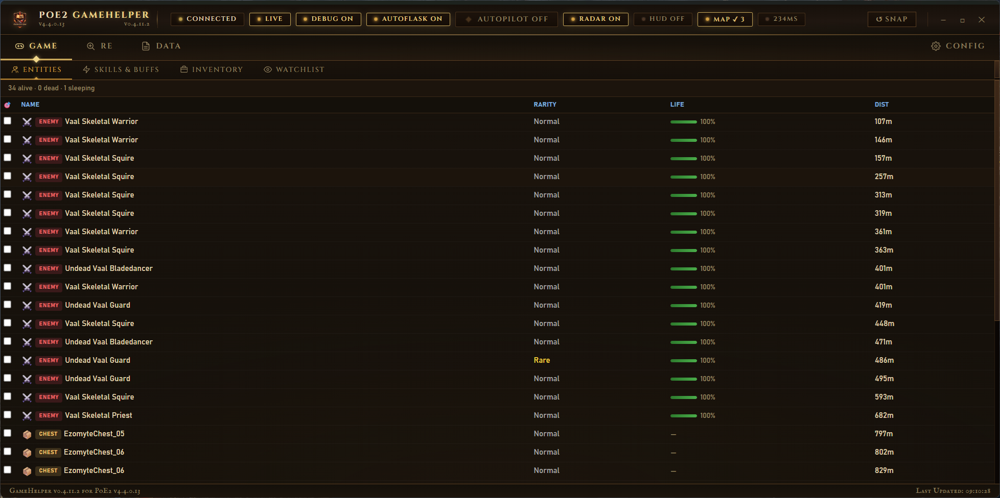
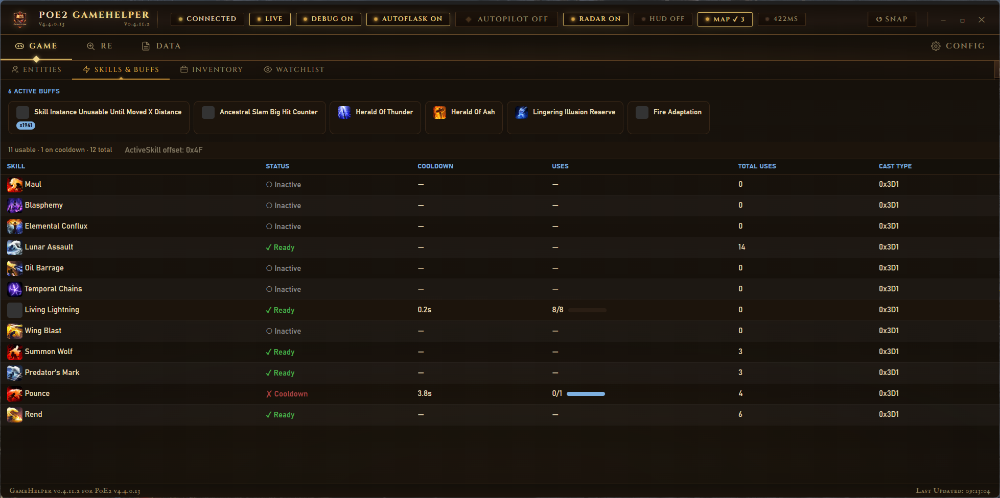
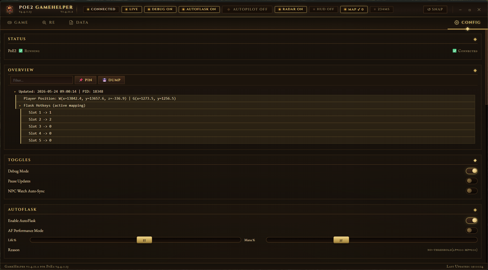
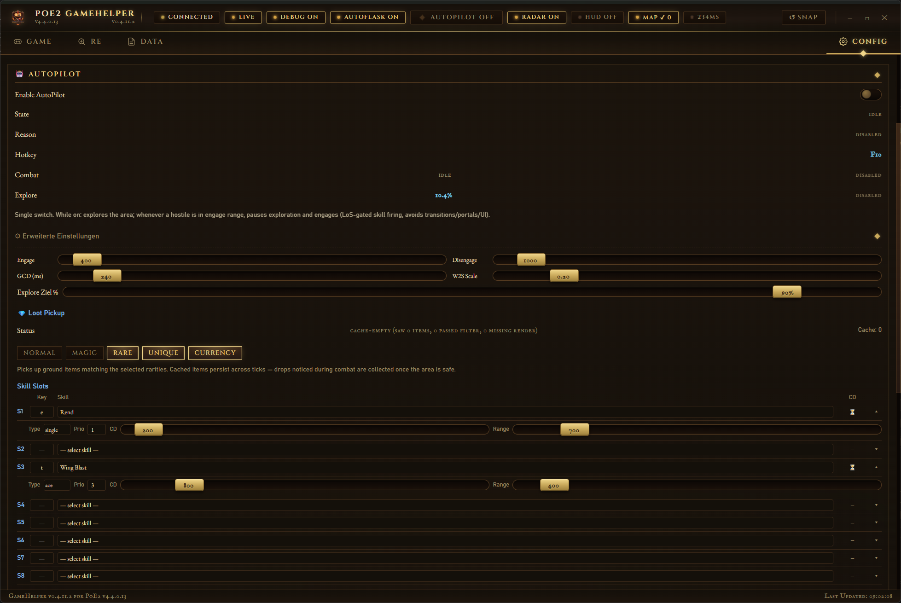

<div align="center">



</div>

---

## Table of Contents
- [Overview](#overview)
- [Features](#features)
- [Requirements](#requirements)
- [Installation & Usage](#installation--usage)
- [Project Structure](#project-structure)
- [References](#references)
- [License](#license)

---

## Overview
**PoE2 GameHelper** is a modern AutoHotkey v2 toolset for *Path of Exile 2*, featuring:
- Real‑time memory reading
- Radar/maphack overlay
- Zone navigation
- AutoFlask automation
- WebView‑based UI

Actively maintained and production‑ready.

---

## Features

### Radar & Maphack Overlay
- High‑performance GDI overlay
- Minimap + Large Map modes
- Full‑zone reveal (maphack)
- Entity icons (NPCs, Bosses, Waypoints, etc.)
- Distance indicators
- Isometric projection
<div align="center"></div>

### Zone Navigation
- A* pathfinding with adaptive step sizes (2/4/8)
- Automatic AreaTransition detection
- Real‑time path rendering

### Memory Reading Engine
- Pattern scanning with RIP‑relative resolution
- Game state tracking (InGame, Loading, Menu)
<div align="center"></div>
- Player vitals, entity decoding, component system
- Awake/sleeping entity maps
<div align="center"></div>
- Inventory & item metadata

### AutoFlask
- Configurable life/mana thresholds
- Cooldown‑aware flask usage
- ControlSend + PostMessage fallback

### Skills & Buffs Panel
- Dedicated UI tab
- Icons, timers, charges
- Blacklist with persistent INI storage
<div align="center"></div>

### WebView‑Based UI
- Multi‑tab interface
- Sortable entity list
- Configurable toggles
<div align="center"></div>
- Clean, modern layout
<div align="center"></div>

---

## Requirements
- AutoHotkey v2.0+
- Path of Exile 2 installed and running
- Administrator privileges (for memory access)

---

## Installation & Usage
```bash
cd <PoE2GameHelper-directory>
"C:\Program Files\AutoHotkey\v2\AutoHotkey.exe" InGameStateMonitor.ahk

```
## Project Structure
```
InGameStateMonitor.ahk (Main Entry, WebView UI Host)
├── PoE2MemoryReader.ahk (Core: Pattern-Scan, Static Addresses, Panel Detection)
│   ├── PoE2EntityReader.ahk (Entity Decoding, TgtTiles)
│   ├── PoE2PlayerReader.ahk (Player Vitals, Flask-Slots)
│   ├── PoE2PlayerComponentsReader.ahk (Stats, Buffs, Charges)
│   ├── PoE2ComponentDecoders.ahk (Shared: Life, Render, Position)
│   └── PoE2InventoryReader.ahk (Inventory & Items)
├── RadarOverlay.ahk (GDI Overlay, Maphack, A* Pathfinder)
├── AutoFlask.ahk (Flask Automation, Render Loop)
├── PlayerHUD.ahk (Compact Player Vitals Overlay)
├── WebViewBridge.ahk (JSON Push, Debug Data Serialization)
├── BridgeDispatch.ahk (WebView→AHK Route Dispatch)
├── ConfigManager.ahk (Config Save/Load)
├── ToggleHandlers.ahk (Feature Toggle Logic)
├── SnapshotSerializers.ahk (JSON Serializers for Tabs)
├── UIHelpers.ahk (WebView Helpers)
├── ErrorLogger.ahk (Error Logging)
└── ProcessMemory.ahk / PoE2Offsets.ahk / StaticOffsetsPatterns.ahk
```

## Referenzen

- [**C# Original**](https://gitlab.com/bylafko/gamehelper2)
- [**Wraedar (Zone Nav)**](https://github.com/diesal/Wraedar)
- [**DAT-Schema**](https://github.com/poe-tool-dev/dat-schema)
- [**poe data tools**](https://github.com/LocalIdentity/poe_data_tools)
- [**AHK v2 Docs**](https://www.autohotkey.com/docs/v2/)

detailed documentation: [`DEV_README.md`](https://github.com/imm0r/PoE2GameHelper/blob/master/DEV_README.md)

## License
This project is licensed under the MIT License. See the [LICENSE](LICENSE) file for details.