<div align="center">

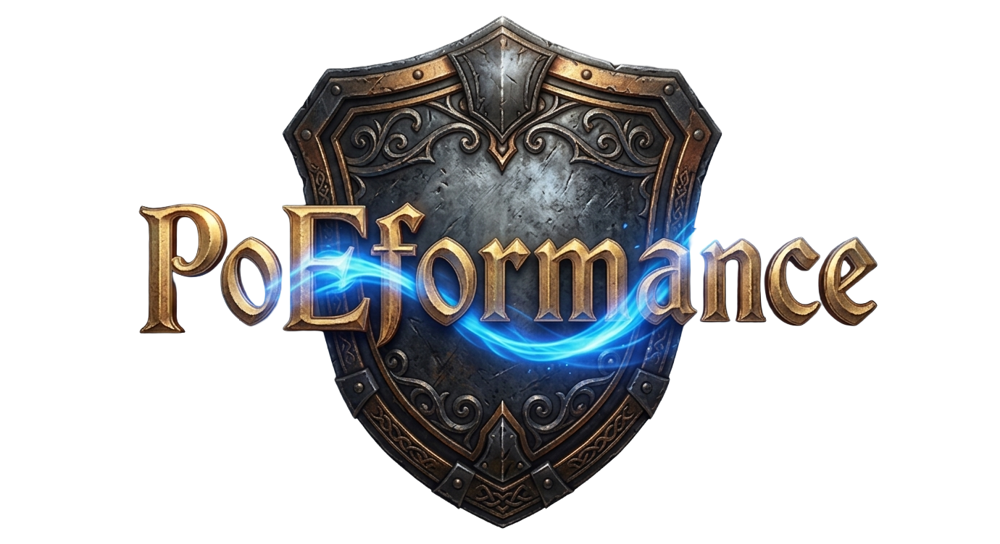

**A modern AutoHotkey v2 toolset for *Path of Exile 2* — overlays, automation, reverse-engineering workbench, and GGPK-level map reveal in one place.**


</div>

---

<div align="center">
  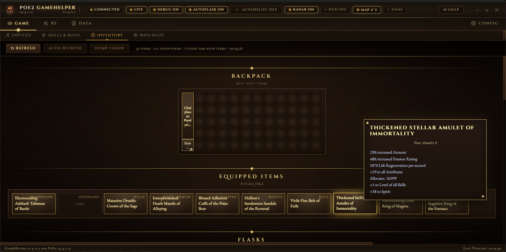
  <p><em>Inventory tab — the "Arcane Codex" theme: vellum pages, illuminated chapter headings, sigil-card items with rarity ink-bleed glows.</em></p>
</div>

---

## Table of Contents

- [Highlights](#highlights)
- [Features](#features)
  - [Automation](#-automation)
  - [Custom Hotkeys](#️-custom-hotkeys))
  - [Loot Pickup](#-loot-pickup)
  - [Overlays](#-overlays)
  - [GGPK Maphack](#-ggpk-maphack)
  - [Live Inspection](#-live-inspection)
  - [Reverse-Engineering Tools](#-reverse-engineering-tools)
- [UI Theme — Arcane Codex](#ui-theme--arcane-codex)
- [Header Anatomy](#header-anatomy)
- [Requirements](#requirements)
- [Installation & Usage](#installation--usage)
- [Hotkeys & Header Controls](#hotkeys--header-controls)
- [Project Structure](#project-structure)
- [References](#references)
- [License](#license)

---

## Highlights

🤖 **AutoPilot** — a single toggle drives unified **combat + loot pickup + exploration**, with LoS-gated skill firing, A\* path overlays, and a hard "don't click UI / transitions / portals" guard.

💎 **Loot Pickup** — rarity-filtered ground-item collection with a persistent cache (drops noticed during combat aren't forgotten) and an actual **per-item-size fit check** against the live backpack grid — fed by a 4 040-entry registry of every PoE2 base item.

🗺 **GGPK Maphack** — patches PoE2's minimap shaders directly in the bundle, with configurable outline + background colors and one-click apply/revert. Reveals the full zone in-game without the radar overlay running.

🔬 **Reverse-Engineering Workbench** — Memory Diff (snapshot · do something in-game · snapshot · diff with multi-format decode), Cheat-Engine-style Dissector for navigating pointer chains, struct-diff Panel Detection, live UI tree browser.

🧪 **Entity Inspector** — every entity in range surfaced with its address, full property block, and a per-component tree. Filter by Id / Path / Type / State, expand any component for inline decoded fields, lazy-fetch on demand for the heavy ones the radar pass skips.

📜 **Arcane Codex UI** — leather-bound grimoire aesthetic, with a full-height logo rail anchoring three stacked navigation rows, a sliding gold underline that glides between active tabs, and a header pill vocabulary that pulses green when connected, copper when paused and crimson when disconnected.

⌨️ **Custom Hotkeys** — a full macro editor (Groups → Hotkeys → Actions) whose output binds to your real in-game flask/skill slots. Manual or condition-driven *automated* triggers, a merged key action (press / hold / loop), chaining, gameplay conditions (vitals / buffs / charges / monster count), and a pixel-radius **auto-aim** around the cursor or the player.

🛰 **Radar overlay** — high-performance GDI render with full-zone reveal, entity icons, A\* path drawing.

💧 **Flask presets** — life & mana flasks auto-fire via default **Custom Hotkey** presets (vitals threshold → charge-gated flask slot), seeded once on first run — replacing the old standalone AutoFlask.

🔌 **Automatic executable detection** — attaches to PoE2 whether it's the Steam or standalone client (32-/64-bit), no configuration needed.

---

## Features

### 🤖 Automation

**AutoPilot — one switch, full automation.** Hit `F10` (or the in-UI pill toggle) and the bot picks up the game: it explores unexplored terrain, engages hostiles when they come into range, collects filter-passing loot when the area is safe, and avoids waypoints / transitions / NPC dialogs.

The priority chain is *combat > loot > explore*; each stage claims a tick by returning true and the next stage only runs when the previous one stayed idle. State is surfaced in real time in the header pill — quiet brown when off, gilded gold when exploring, blood-red pulse during combat.

- **LoS-aware combat aiming** — A\* path computed when terrain blocks the straight line; the bot aims at the farthest waypoint with line-of-sight and walks via LMB until the enemy itself becomes visible. Skill keys **only** fire on direct LoS (no cooldown wasted on walls).
- **Click safety (`AvoidZones`)** — shared registry of screen-coordinate keep-out rects covering HUD elements (life globe, skill bar, minimap) + interactable world entities (transitions, waypoints, portals, NPCs). Combat and loot both consult it before any click.
- **Loot Pickup** — see below.

**Flask automation (via Custom Hotkeys)** — life/mana flask use now lives in the hotkey engine. A default **Flasks** group is seeded on first run — *Life Flask* (slot 1, ≤ 55 % life) and *Mana Flask* (slot 2, ≤ 35 % mana), each an automated vitals condition firing a charge-gated flask output. The old standalone AutoFlask is retired.

<div align="center">
  
  <p><em>AutoPilot configuration — master toggle, F10 hotkey, status feed, with the advanced tuning collapsed.</em></p>
</div>

### ⌨️ Custom Hotkeys

A dedicated **Hotkeys** tab turns the helper into a programmable macro engine. The model is three nested levels — **Groups → Hotkeys → Actions** — all drag-to-reorder, collapsible, and individually toggleable, with per-item import/export to JSON.

<div align="center">
  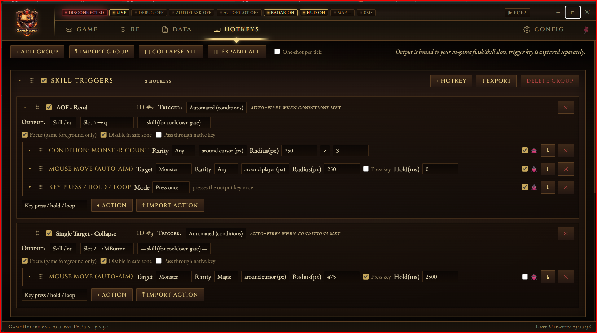
  <p><em>Hotkeys tab — a group of hotkeys, each with its output bound to an in-game slot and a manual/automated trigger.</em></p>
</div>

Every hotkey's **output is bound to a real in-game bind** picked from a dropdown of your actual flask/skill slots (parsed from `poe2_production_Config.ini`), so you never re-type key names — the trigger key is captured separately.

- **Triggers** — *manual* (fires on the physical key press) or *automated* (auto-fires from the evaluation tick whenever the hotkey's conditions are met). An optional **one-shot per tick** guard limits automated firing to the highest-priority hotkey in list order.
- **Key action** — a single action with a **Mode** selector: *press once*, *hold* (configurable duration), or *loop / repeat* (finite count + interval, or an infinite toggle). Repeats are cooldown-aware so a skill isn't spammed during its cooldown.
- **Chain** — trigger another hotkey by id (with a delay and a user/program trigger filter) to compose multi-step macros.
- **Conditions** — gate an action on live game state: **vitals** (life/ES/mana %), **buff** present/absent with min stacks & time-left, **charges** (power/frenzy/endurance/charged-staff), and **monster count** within a radius — a screen-pixel radius *around the cursor* / *around the player*, or a zoom-independent **world-unit range** around the player (plus an experimental world-range around the cursor).
- **Auto-fire output** — a hotkey with conditions but no explicit key action simply presses its bound output once when the conditions pass, so "flask slot 2 + mana < 35 %" works on its own.
- **Charge-aware flask output** — when the output is a flask slot, it fires only while that flask holds a full charge and its buff isn't already active (the behaviour the retired AutoFlask had).
- **Auto-aim** — moves the cursor to the nearest matching entity inside a pixel radius (around cursor or player). Target type is chosen from a dropdown — *monster* (with rarity filter), *chest* (with a live dropdown of the chest types actually present in the area), *player/NPC*, *custom metadata path*, or *any (debug)* to scan everything — with an optional key press / hold after aiming.
- **Per-action debug** — a 🐞 toggle surfaces live diagnostics in the standalone **Debug Overlay** (Config → Overlay): the fired key, when it **last fired**, the vitals condition's live value & percent, **flask charge** readiness, and the **full active-buff list** with the checked buff / charge highlighted green. The matching **range circle** is drawn on the radar — a pixel ring at the cursor / player, or an isometric world-radius ground ring — with monster counts by rarity beside it.

<div align="center">
  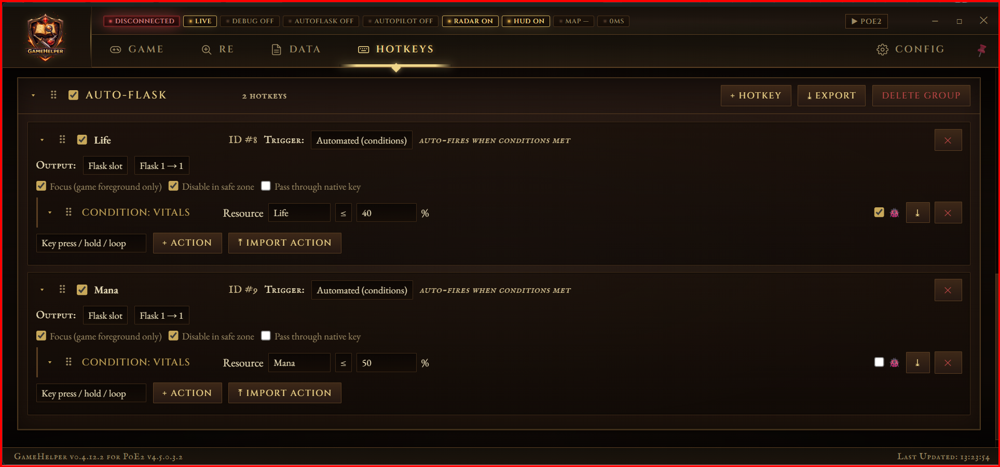
  <p><em>The action editor — key/condition/aim actions with per-action debug toggles and drag-to-reorder.</em></p>
</div>

### 💎 Loot Pickup

Filter ground drops by rarity (Normal · Magic · Rare · Unique · Currency) and the bot collects them when no hostile is in engage range. Items dropped *during* combat stay in a persistent cache so they're not forgotten — once the area is safe, the bot walks back for them.

- **Per-item-size fit check** — the bot reads each item's exact `inventory_width × inventory_height` from the bundled [base-item registry](data/base_item_sizes.tsv) (4 040 entries derived from [repoe-fork/poe2](https://repoe-fork.github.io/poe2/base_items.json)). Before clicking, it builds the **live backpack occupancy grid** and verifies there's a contiguous free rectangle that fits — no more "tried to pick up a 2×3 body armor with 5 scattered free cells".
- **Picked-up detection** — when a clicked entity disappears from the snapshot, it's removed from the cache immediately so the bot doesn't keep clicking ghost world positions.
- **Inventory-full gate** — the bot pauses pickup with a clear "inventory-full" status when no fitting rectangle exists; resumes automatically when you free space.

<div align="center">
  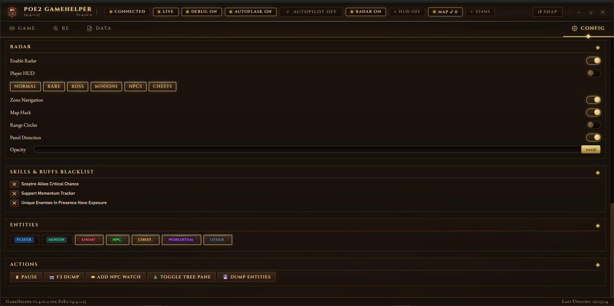
  <p><em>Loot Pickup — five rarity filter pills, live cache count, last-action status.</em></p>
</div>

### 🗺 Overlays

**Radar** — high-performance GDI overlay with minimap + large-map modes, full-zone reveal, entity icons (NPCs, Bosses, Waypoints, Chests), distance indicators, and isometric projection. The large-map maphack is **source-clipped** to the on-screen viewport (it transforms only the visible slice of the terrain bitmap, not the whole ~1 MPixel image) and **HUD-masked** so its outline never paints over the game's orbs, skill / flask / XP bars or the area / quest panel — tunable clip rectangles, with a debug toggle to outline them.

<div align="center">
  
  <p><em>The radar overlaid on the game window — entities, A* combat path, zone reveal.</em></p>
</div>

**Zone Navigation** — A\* pathfinder with adaptive step sizes (2/4/8) and automatic AreaTransition detection.

**Vitals overlay** — a fully configurable replacement for the old fixed Player HUD. Life, Mana and Energy Shield each render as their **own** independently placeable bar — drag-to-place edit mode, per-bar size, foreground/background/outline colours, opacity, and any combination of current / max / percentage text.

- **Per-bar visibility rules** — each bar carries a prioritised condition list (drag & drop to reorder, add/remove, import/export). Conditions include **On Low Vital** (ES / Life / Mana threshold), **In Combat**, and per-condition **True / False** booleans, combined with Match All / Any and a Show / Hide outcome.
- **Combat without the bot** — the **In Combat** condition is driven by a lightweight, proximity-only combat detector, so a bar can appear/disappear based on nearby hostiles even when AutoPilot is switched off (and it costs nothing when no bar uses it).

**Unified overlay manager** — radar, vitals, focus and notification overlays all run through one manager with a shared per-tick context and a single visibility policy: they're hidden from the taskbar (`+ToolWindow`), hide when you alt-tab away from PoE, no longer flicker on transient memory-read gaps, and self-heal if the OS hides or de-promotes the overlay window after a long alt-tab (the window state is verified against `IsWindowVisible` each tick, with a periodic top-most re-assert).

<div align="center">
  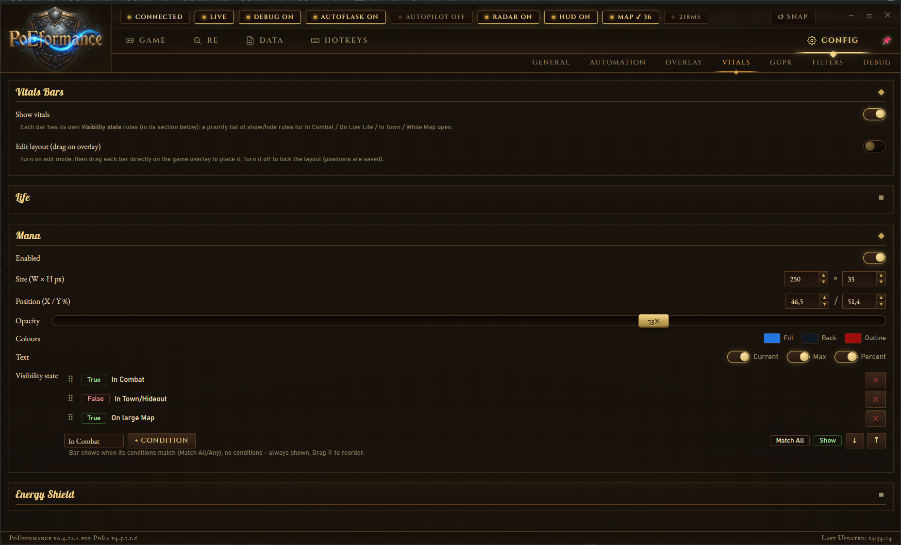
  <p><em>Config → Vitals — each bar has its own size/position/colours/opacity and a prioritised visibility rule list (In Combat · On Low Vital · In Town · While Map open).</em></p>
</div>

### 🗺 GGPK Maphack

The Radar shows a reveal **in the overlay**. The GGPK Maphack does the same thing **inside the game itself**, by patching PoE2's actual minimap shaders inside the bundle.

The patcher (written in C# as part of `ggpk-tools/`) targets two shader files:

- `shaders/minimap_visibility_pixel.hlsl` — forces the explored-tile ratio to `1.0`, so every cell renders as "this is revealed."
- `shaders/minimap_blending_pixel.hlsl` — swaps two hardcoded `float4(...)` literals: the interior-walkable wash colour and the wall-outline colour. The user picks both via an in-app HSV/hex colour picker.

Apply / revert is one click each from the **Config → GGPK** sub-tab. Every modified file is backed up automatically before write, and the patcher refuses to run if any marker has shifted in a game patch (saves you from a half-patched bundle that wouldn't render). The `_.index.bin` is snapshotted before each apply too, so a `--revert` always has a known-good baseline to restore.

**Outline and background colours are independently tunable.** Outline gets the wall ridge; background fills walkable interior. Pick low background alpha (5–10 %) for a subtle ExileForge-style wash, or crank both for a screenshot-ready high-contrast view.

> ⚠️ Modifying `Content.ggpk` / `_.index.bin` is detectable in principle by any anti-cheat the game might run. PoE2 currently doesn't have aggressive client-side anti-cheat, but **using this is at your own risk** — see [SECURITY.md](.github/SECURITY.md) for scope notes.

### 🔍 Live Inspection

The WebView UI ships a multi-tab inspection layer over the live game state. Everything updates from the same memory-reader snapshot the automation modules consume.

**Entity Inspector** — proper memory-inspector view of every entity in range. Filter the list by Id, path substring, Type, or State (Awake / Sleeping / Alive / Dead); the Type dropdown auto-populates from the types actually present in the live snapshot. Each row expands into:

- A **Properties** block: address (hex), id, full metadata path, type, state, rarity (+ raw id), alive flag, life %, distance, component count.
- A **Components** tree: every attached component listed with its memory address. Components the snapshot already carries decoded data for (Render, Life, Positioned, Targetable, …) expand inline into key/value pairs — coordinates flatten to `x=…, y=…, z=…`, booleans render as `✓ yes` / `✗ no`.
- **Show in game** toggles the radar highlight for that entity; **Copy JSON** writes the full entity record to clipboard.

The radar fast-path skips heavy decoders (Stats, Buffs, Actor, Animated, StateMachine, …) for cost reasons — those rows show a `📡 click to decode` hint. Clicking fires an on-demand decode for that single component and auto-expands the row once the result arrives. Garbage strings (uninitialized memory mis-read as UTF-16) are replaced with `— invalid memory` so the panel stays readable.

<div align="center">
  
</div>

**Skills & Buffs** — currently active skills + buffs with cooldowns, charges, and timers.

<div align="center">
  
</div>

**Inventory** — backpack grid + equipped slots + flask bar + every stash tab the game has populated. Hover any item for a parchment-slip tooltip with the full mod list.

<div align="center">
  
</div>

**Watchlist** — pin any memory-tree path and watch its value live.

<div align="center">
  
</div>

### 🔬 Reverse-Engineering Tools

A first-class workbench for poking PoE2's memory — collected under a dedicated `RE` category in the navigation.

#### Memory Diff
Snapshot a memory region around a named anchor (`ServerDataStructure` / `GameUI` / `AreaInstance` / `InGameState`) or a raw hex address, do something in-game, snapshot again. Diff the byte runs that changed with multi-format decodes (i32 / u32 / i64 / ptr / float). Collapses hours of "find the byte that toggles when I open stash" into seconds.

<div align="center">
  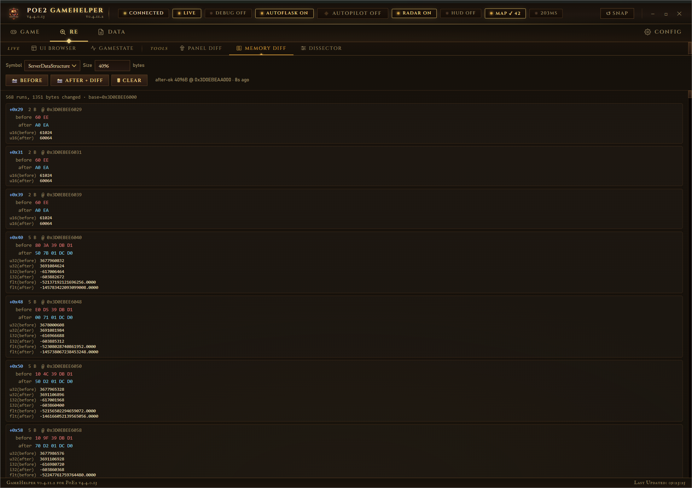
</div>

#### Dissector — Cheat-Engine-style memory navigator
Any address rendered as an 8-byte-stride table: hex · i32 · u32 · f32 · i64 · ptr · f64 · ASCII. Click any pointer cell to dereference and jump there — back/forward history, configurable page size (64 B — 8 KB), page-aware reading that gracefully degrades at uncommitted-page boundaries.

<div align="center">
  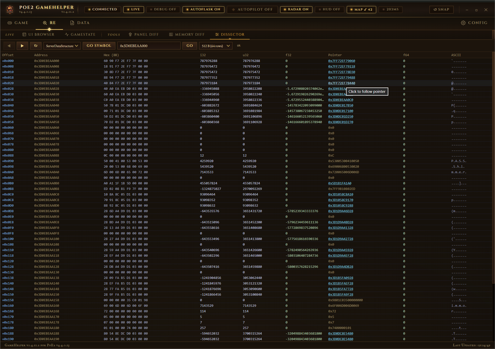
</div>

#### Panel Detection (struct diff)
Capture a struct baseline, open a game panel, compare. Surfaces the exact byte offsets that flip when each panel opens — the foundation of the "is the inventory window currently open?" guard used by all the automation modules. Lives under **Config → Debug** (moved there from a retired sub-tab, since it's diagnostic config in practice).

<div align="center">
  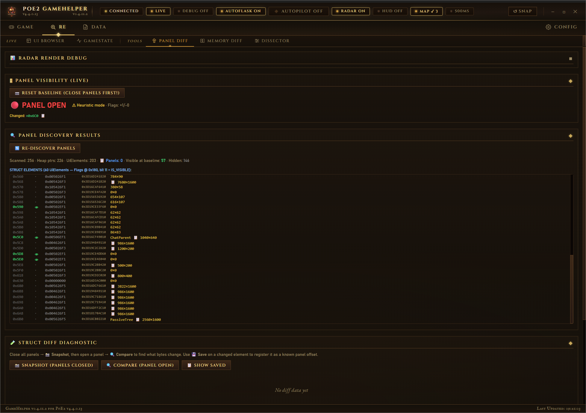
</div>

#### UI Browser
Walk the game's live UI element tree from the root.

<div align="center">
  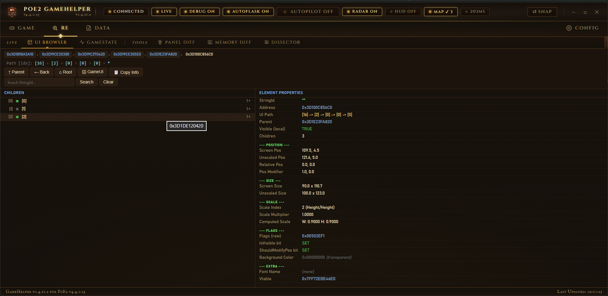
</div>

#### gameState
Read-only view of the master `InGameState` struct — every nested object, decoded into a navigable tree.

<div align="center">
  
</div>

#### Data
Generated TSV exports (stat templates, base-item registry, mods, monster names, unique items, etc.) for offline analysis. The pipeline that produces them lives under `ggpk-tools/PoeDataExtract/` and re-runs automatically when the helper detects a game patch.

<div align="center">
  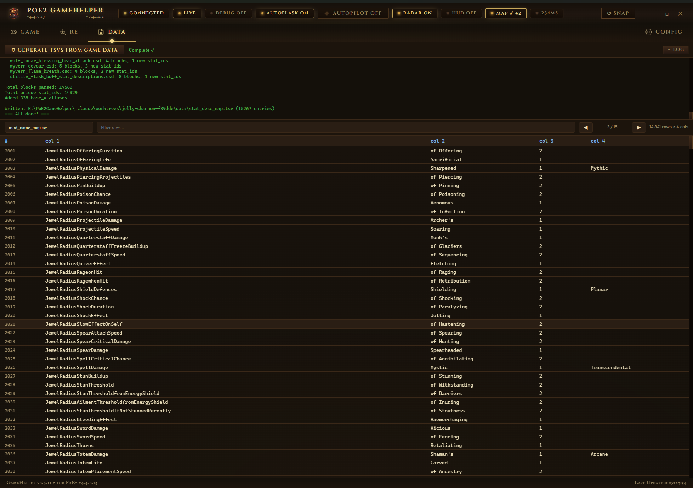
</div>

---

## UI Theme — Arcane Codex

The interface is intentionally framed as a leather-bound grimoire of relics — a single bold aesthetic direction executed across every surface:

- **Typography** — [Cinzel](https://fonts.google.com/specimen/Cinzel) for illuminated chapter headings, [EB Garamond](https://fonts.google.com/specimen/EB+Garamond) for body text and item names, [IM Fell English SC](https://fonts.google.com/specimen/IM+Fell+English+SC) for engraved numerals. Windows-native serif fallbacks (Constantia / Palatino / Georgia) keep the aesthetic intact when offline.
- **Palette** — warm dark browns and aged ivory for the parchment; antique gold for active states and rules; blood crimson reserved for urgent combat warnings; cool steel-blue retained for "info" highlights to keep them distinct from automation gold.
- **Header pill vocabulary** — each pill carries state colour AND animation, so a glance is enough during combat:
  - *Connected* — healthy green slow pulse (2.4 s), the positive pendant to the disconnected crimson.
  - *Paused* — copper-amber slow pulse (2.4 s). Halts updates can't masquerade as "off" pills.
  - *Disconnected* — blood crimson at the same pulse rhythm, so the two read as one "attention required" family with the cause encoded only in colour.
  - *AutoPilot — combat* — fast crimson pulse (1.4 s), a deliberate urgency over the paused/disconnected calm.
- **Sliding tab marker** — one gold underline per bar (categories + sub-tabs) that glides between active positions with a 280 ms cubic-bezier transition instead of jumping. The little diamond fleuron rides on top of the marker so it travels with the rule.
- **Inventory chapter** — vellum-page background with paper-grain noise + corner vignettes; item cards as sigil-slips with rarity-tinted ink-bleed glows (Rare items carry a subtle 4.5 s brightness pulse); tooltip is a parchment slip with corner fleurons and gilded section dividers.

<div align="center">
  
  <p><em>Config tab split into six sub-tabs (General · Automation · Overlay · GGPK · Filters · Debug) — codex-framed sections, brass-thumbed sliders, inscribed-switch toggles.</em></p>
</div>

---

## Header Anatomy

The top of the app is a single visual frame around three stacked rows on the right of a full-height logo rail:

| Row | Contents |
|---|---|
| Pills row | State pills (Connect · Pause · Debug · AutoPilot · Radar · HUD · Map · ⏱ Benchmark) + `↺ Snap` / `▶ PoE2` dual button + window controls (min / max / close) |
| Category bar | `GAME` · `RE` · `DATA` · `HOTKEYS` · `CONFIG` + the **📌 Always-on-Top** pin (next to Config, tilted -25° when off, upright + gilded when on; state persisted to the config INI) |
| Sub-tab bar | Sub-tabs of the active category — sliding underline marker glides between selections |

The logo on the left fills the whole topbar height. **Hover it** for a popover with the project name + game/app versions; **click it** to open the GitHub repo in your default browser.

The `Snap` button does double duty: when PoE2 is running it sends a `TreeRefresh` (re-syncs the helper's tree from the live game). When PoE2 isn't running it morphs into `▶ PoE2` and launches the game via Steam.

Two compact-mode tiers kick in as the window narrows: pills shrink at ≤ 1300 px and shed their text labels in favour of a per-pill icon at ≤ 850 px (the underlying `data-tip` tooltip still reveals the full label on hover).

---

## Requirements

- **AutoHotkey v2.0+** — [download](https://www.autohotkey.com/)
- **Path of Exile 2** — Steam or standalone, both supported and **detected automatically** (Steam / standalone, 32-/64-bit executables)
- **Administrator privileges** — required for `ReadProcessMemory` against an elevated game process
- **WebView2 Runtime** — pre-installed on Windows 11; Windows 10 may need the [Evergreen runtime](https://developer.microsoft.com/en-us/microsoft-edge/webview2/)
- **.NET 8 SDK** *(only if you want to use the GGPK Maphack or rebuild the data extractor)* — [download](https://dotnet.microsoft.com/download/dotnet/8.0)

---

## Installation & Usage

```bash
# Clone (with the LibGGPK3 submodule that ggpk-tools depends on)
git clone --recurse-submodules https://github.com/imm0r/PoEformance.git
cd PoEformance

# Run (path may vary; AHK v2 install location)
"C:\Program Files\AutoHotkey\v2\AutoHotkey.exe" InGameStateMonitor.ahk
```

The WebView UI window opens immediately. Start *Path of Exile 2* (or have it running already). The helper scans for every known PoE2 executable — Steam and standalone, 32- and 64-bit — and attaches to whichever is running, so no path or process name needs to be configured. The header `Disconnected` pill flips to `Connected` once it attaches; from there everything is live.

If you also want the **GGPK Maphack**, build the C# tools once:

```bash
cd ggpk-tools
dotnet publish PoeDataExtract -c Release -r win-x64 --self-contained -p:PublishAot=true
dotnet publish PoePatcher     -c Release -r win-x64 --self-contained -p:PublishAot=true
```

The AHK side shells out to the resulting `.exe`s — rebuild whenever you pull updates that touch `ggpk-tools/`.

---

## Hotkeys & Header Controls

| Input | Action |
|---|---|
| `F10` | Toggle **AutoPilot** (combat + loot + explore) |
| `F3` | One-shot debug dump (TreeView + game-window screenshot + radar entity TSV) |
| Click pill | Toggle the corresponding feature (Pause, Debug, AutoPilot, Radar, HUD) |
| Click ⏱ pill | Start / stop the performance benchmark (shows fps when idle, "● REC" while measuring); hover it for the per-marker timing table |
| Click 📌 (next to Config) | Toggle Always-on-Top — visual state tilts/straightens, persisted to the config INI |
| Click `↺ Snap` / `▶ PoE2` | Refresh the tree (game running) OR launch the game via Steam (game not running) |
| Click logo | Open the GitHub repo in your default browser |
| Drag header | Move the window — bound to the pills row and the category / sub-tab bars, doesn't trigger on pills, tabs or buttons |
| Double-click header | Maximise / restore |

Most other toggles live in the **Config** tab (split into six sub-tabs — General · Automation · Overlay · GGPK · Filters · Debug) — AutoPilot tuning, radar entity filters, loot rarity filter, GGPK maphack apply/revert + colour pickers, and per-skill slot configuration. (Flask thresholds now live in the default flask **Custom Hotkeys** instead.)

User-defined macros live in their own **Hotkeys** category (see [Custom Hotkeys](#-custom-hotkeys)) — define a trigger key there and its output is bound to one of your in-game flask/skill slots.

---

## Project Structure

```
InGameStateMonitor.ahk          ─ main entry / WebView host (the only .ahk in repo root)
│
│   All other .ahk modules live in ahk/ (shown below grouped by area). Non-.ahk
│   paths — ui/, Lib/, ggpk-tools/, data/, external/, .github/ — keep their own
│   top-level folders. Logs are written to logs/.
│
├── Automation  (ahk/)
│   ├── AutoPilot.ahk           ─ master state machine (combat > loot > explore)
│   ├── CombatAutomation.ahk    ─ LoS-aware aim, skill rotation, A* approach
│   ├── ExplorationModule.ahk   ─ visited-cell tracking, frontier finding
│   ├── LootPickup.ahk          ─ ground-item cache + fit-check pickup
│   ├── AvoidZones.ahk          ─ shared screen-rect keep-out registry
│   ├── ItemSizeRegistry.ahk    ─ base-item dimensions (loads data/base_item_sizes.tsv)
│   └── AutoFlask.ahk           ─ legacy flask automation (retired; flasks now via hotkey presets)
│
├── Custom Hotkeys
│   ├── CustomHotkeys.ahk          ─ macro engine: groups/hotkeys/actions, conditions, auto-aim
│   ├── CustomHotkeysBindings.ahk  ─ resolves in-game flask/skill binds + chest types for the UI
│   └── CustomHotkeysBridge.ahk    ─ config persistence + import/export bridge
│
├── Memory reading
│   ├── PoE2MemoryReader.ahk         ─ core: pattern-scan, RIP-relative, panel diff
│   ├── PoE2EntityReader.ahk         ─ entity decoding + radar tile reads
│   ├── PoE2PlayerReader.ahk         ─ player vitals, flask slots
│   ├── PoE2PlayerComponentsReader.ahk ─ stats, buffs, charges
│   ├── PoE2ComponentDecoders.ahk    ─ shared component decoders
│   ├── PoE2InventoryReader.ahk      ─ inventories, items, mods, stash tabs
│   ├── PoE2Offsets.ahk              ─ struct offsets + discovered panel offsets
│   ├── StaticOffsetsPatterns.ahk    ─ pattern → static-pointer resolution
│   └── ProcessMemory.ahk            ─ RPM wrapper, pointer chain helpers
│
├── Overlays
│   ├── OverlayManager.ahk      ─ owns every overlay, shared per-tick context
│   ├── OverlayContext.ahk      ─ snapshot/reader/window state passed to overlays
│   ├── PlayOverlayPolicy.ahk   ─ single play-overlay visibility gate
│   ├── GdiOverlayBase.ahk      ─ reusable transparent, click-through GDI layer
│   ├── RadarOverlay.ahk        ─ GDI overlay + zone reveal + A* drawing
│   ├── VitalsOverlay.ahk       ─ configurable Life/Mana/ES bars (replaces PlayerHUD)
│   ├── NotificationOverlay.ahk ─ map-independent banner layer
│   └── Lib/TerrainPathfinder.ahk ─ A* with adaptive step sizing
│
├── GGPK Maphack (.NET 8)
│   ├── ggpk-tools/PoePatcher/      ─ C# patcher: applies + reverts shader edits
│   │   └── Patches/MinimapPatch.cs ─ the two shader markers + colour swaps
│   ├── ggpk-tools/PoeDataExtract/  ─ C# data extractor (TSVs in data/)
│   └── GgpkToolBridge.ahk          ─ AHK shell-out wrapper + apply/revert state
│
├── Reverse-engineering
│   ├── MemoryDiff.ahk          ─ snapshot/diff with multi-format decode
│   ├── MemoryDissect.ahk       ─ CE-style memory navigator + history
│   └── UiTreeBrowser.ahk       ─ live UI tree traversal
│
├── UI / Bridge
│   ├── ui/index.html           ─ WebView UI (single page, Codex theme)
│   ├── WebViewBridge.ahk       ─ AHK → JS push (snapshots, status, JSON)
│   ├── BridgeDispatch.ahk      ─ JS → AHK route dispatch
│   ├── UIHelpers.ahk           ─ WebView control helpers
│   ├── SnapshotSerializers.ahk ─ JSON serializers per tab
│   ├── TreeViewWatchlistPanel.ahk ─ watchlist pinning logic
│   └── Lib/WebViewToo.ahk      ─ WebView2 ComCall wrapper
│
├── Support
│   ├── ConfigManager.ahk       ─ INI save/load
│   ├── ToggleHandlers.ahk      ─ feature-toggle wiring
│   ├── ErrorLogger.ahk         ─ rotating error.log
│   ├── PatchChecker.ahk        ─ detect game updates / version drift
│   └── JsonParser.ahk          ─ AHK v2 JSON parsing
│
├── data/                       ─ generated data assets
│   ├── base_item_sizes.tsv     ─ 4040-entry path → (w, h) (for loot fit-check)
│   ├── stat_desc_map.tsv       ─ mod template descriptions
│   ├── unique_item_name_map.tsv ─ unique-item name resolver
│   └── *.tsv                   ─ name maps, monster data, item base names
│
├── .github/                    ─ community + automation files
│   ├── CONTRIBUTING.md
│   ├── CODE_OF_CONDUCT.md
│   ├── SECURITY.md
│   └── PULL_REQUEST_TEMPLATE.md
│
└── external/                   ─ git submodules (don't delete)
    └── LibGGPK3/               ─ Content.ggpk + Bundles2 parser (used by ggpk-tools)
```

---

## References

- [**C# Original (GameHelper2)**](https://github.com/Gordin/GameHelper2) — the original tool this AHK port draws inspiration from (branch `main`)
- [**LibGGPK3**](https://github.com/aianlinb/LibGGPK3) — the Content.ggpk + Bundles2 parser that powers `ggpk-tools` (vendored as a submodule under `external/`)
- [**Wraedar (Zone Nav)**](https://github.com/diesal/Wraedar) — terrain pathfinding reference
- [**DAT-Schema**](https://github.com/poe-tool-dev/dat-schema) — PoE/PoE2 game-data schema
- [**poe-data-tools**](https://github.com/LocalIdentity/poe_data_tools) — PoE data file utilities
- [**repoe-fork (PoE2 base items)**](https://repoe-fork.github.io/poe2/base_items.json) — base-item registry source

Detailed developer notes: [`DEV_README.md`](DEV_README.md). Contribution conventions: [`.github/CONTRIBUTING.md`](.github/CONTRIBUTING.md).

---

## License

MIT — see [`LICENSE`](LICENSE) for the full text. The `ggpk-tools/` subtree is AGPL-3.0 — see [`ggpk-tools/LICENSE`](ggpk-tools/LICENSE).

<div align="center">
  <sub>Built with ❤️ for the <em>Path of Exile 2</em> community.</sub>
</div>
